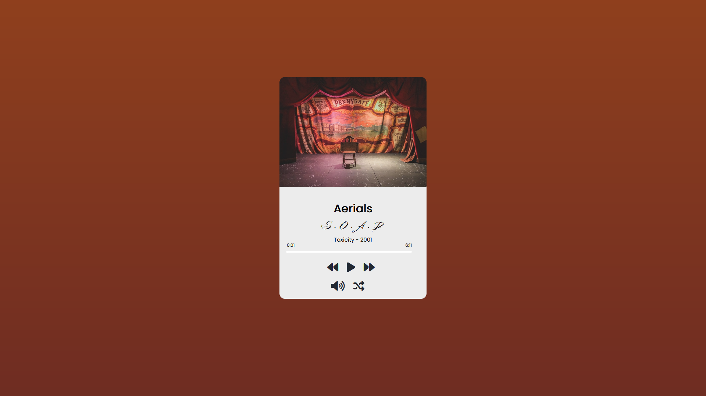
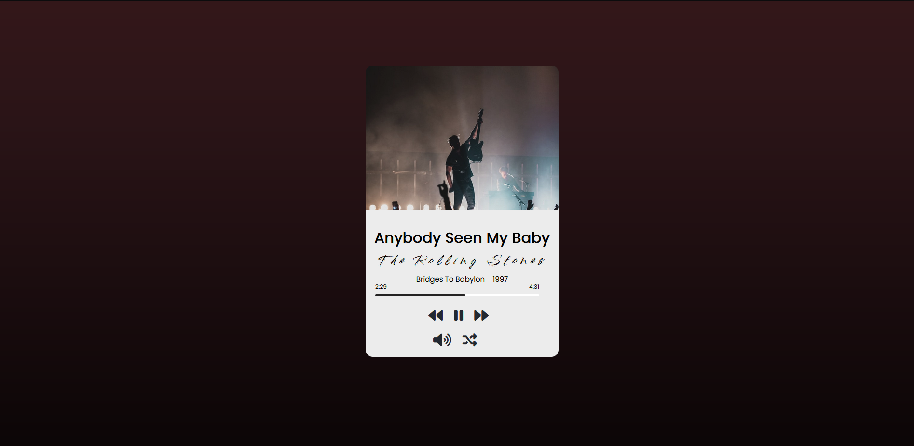

# <u>Music Player<u>

## About the project

Streaming music is a major activity people use the internet these days. For this reason, creating a media platform with a regular music player app features is great and fun project.In this project i've created a music player using HTML, CSS, JavaScript, and the HTML5 Audio API with which can play music on your browser.

## For this project i used

## The project

